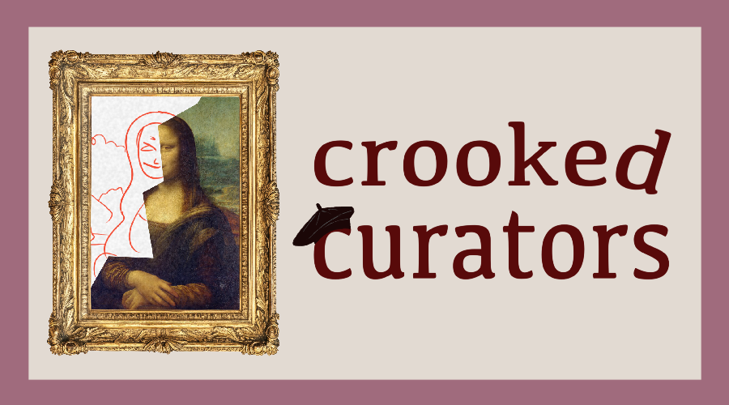
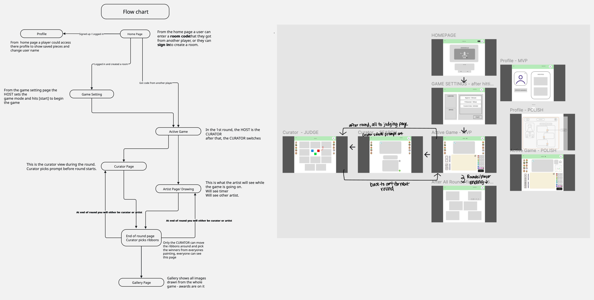

# Crooked Curators


Welcome to **CROOKED CURATORS!**


Tonight there is a gallery opening at the local museum, but there's one problem... the curator cannot find any art pieces! Now, the museum is desperately looking for genuine pieces to fill the empty halls! You and your friends have cooked up a scheme to create forgeries to trick the curators into purchasing as an authentic piece.



How to play is simple: each round one person acts as the curator and searches for a fine art image. The reference the curator selects is sent to the rest of the players, who are the artists. The artists do their best to make a forgery of the reference to trick the curator. At the end of the round, the curator will award ribbons to the pieces which all have a varied number of points. Keep playing until everyone has been curator one time and then see all your beautiful artworks in the end gallery!

***

**Views and Game Flow Diagram**




***

**Style Guide ->**
[Style Guide](_STYLE-GUIDE.md)

***

**Detailed Game Flow Explanation**

If a user selects "Create Game":
  - If user is not already signed-in, the user will be redirected to sign in. Only signed-in users can create a game.
  - User is brought to game settings and is set as the game's "Host". The host will be able to start the game.

If a user selects "Join Game":
  - User will need to input a game code and will be redirected to the game settings page 
  - Inside game settings, there is a lobby with all the other player usernames

The game starts! Each round, a random player will be selected as the "Curator" for the round and everyone else will be "Artists."

If the user is...:

  - An Artist:
    - artist sees a screen with the curator-chosen reference image,  a canvas to draw on, and a SUBMIT button

  - A Curator:
    - The curator sees a screen with a search input field, an image box,  a 're-roll' button, and a 'select' button
    - The curator can search a keyword, which will show a fine art piece in the image box
    if the curator does not like the first image, they can hit 're-roll' to bring up another image from the search
    - The curator gets 3 're-rolls' and then they must pick the last image
    when the curator hits, 'select' the fine art image is sent to the artists to draw from

Once the artists have all submitted their pieces, the curator will hit the 'Judging time!' button and brings everyone to the Judging view:

  -  The curator will be granted three ribbons, a Blue Ribbon (positive), White Ribbon (neutral), and Red Ribbon (negative), to award to artists of the round. An artwork can only be awarded one ribbon in the judging stage.
  - All artworks awarded a ribbon will be featured in the ending gallery.

A ribbon's color does not determine it's points awarded to the artist. Different ribbon titles have different points associated. A Red ribbon that is negative may be worth more points than the Blue ribbon of the round.

Blue Ribbons:
  - Museum is Getting Sued 200pts
  - Best in Show 180pts
  - Most Accurate 160pts
  - Perfect Counterfeit 140pts
  - We Get It, You're an Artist 120 pts
  - NOBODY is Gonna Know 100pts

White Ribbons:
  - Oh Bless Your HeART 200pts
  - Most Okayest 150pts
  - Barely Above Average 170pts
  - It Does Count as "Art" 130pts
  - Most Unfinished 110pts

Red Ribbons:
  - Museum is Getting Sued 200pts
  - Truly Horror Inducing 180pts
  - It Made My Child Cry 160pts
  - Not Fit for Eyes 140pts
  - Most Disturbing 120pts
  - Most Disliked 100pts

After all rounds are complete, everyone is redirected to a gallery view, where all artworks that were awarded ribbons will be viewed in a carousel and everyone's points across all rounds are tallied up.

# How to Start Up Project


# Project Structure

**Front End Structure**

- Index - Wraps App in routing for React Routing
  - App - Contains page layout and routing
    - Navbar
    - Breadcrumbs
      [SWAPPING COMPONENTS]
      - Homepage
        - Username Randomizer
        - Avatar Selection (not yet implemented)
        - Create Game (not yet implemented)
        - Join Game
      - Profile
      - Sign-In
        - Signs in with Google OAuth 20
    - Footer

***
**Backend Structure**

Server 
- Routes dir: handling requests
  - artworks
  - auth-redirect
  - create-game
  - curator
  - name-randomizer
  - s3-storage

- Sockets dir: socket.io logic
  - index.ts

- app.ts
  - express app, middleware, server listen

- auth.ts
  - Google Strategy for passport google oauth 20

- randomUsernames.json
  - silly random names 

- s3.ts
  - generate a temporary link to upload to S3 bucket

***
**Sockets**

On the backend the socket server is made by passing the express app into an http server. This server is exported into sockets/index.ts and io = new Server(server).

`Outer variables:`

  *currentGame*
    - the game object (representing the current game) from the database

  *currentRound*
    - holds a round object that was just created from the db 

  *curator*
    - user object from the db for who is currently curator

  *roundCount = 0*
    - round is initialized at 0

  *allPlayers = []*
    - array of objects from database from querying the user_rounds table

`Inside io.on('connection')`

  *socket.on disconnect* 
    - listens for socket disconnect

  *socket.on joinGame*
    - listens for when the user hits the join game button

  *socket.on curatorSelect*
    - listens for when curator makes an art reference selection
    - updates the current round with the reference image game context 

  *socket.on nextStage*
    - listens for when the user triggers the next round in game
    - contains the advanceRound helper function invocation

  *advanceRound function*
    - helper function passed into nextStage

***
**Seeding Ribbons to Database**

Generate a seeding file:
`npx sequelize-cli seed:generate --name demo-ribbons`

Seed all seed files:
`npx sequelize-cli db:seed:all`

***
**A note on synchronizing DB tables**

*If you want to clear tables/ edit fields/ etc*
1) drop database crooked_curators;
2) create database crooked_curators;
3) in db/index.ts run server with this sync:

  ```
  const syncModels = async () => {
    try {
      await User.sync();
      await Game.sync();
      await User_Game.sync();
      await Round.sync();
      await Ribbon.sync();
      await Artwork.sync();
      console.log('All models synchronized successfully')
    } catch (err) {
      console.error('failed to sync models', err)
    }
  }
  syncModels();
  ```

*An interesting alternative to clear tables a different way*
1) db/index.ts run both of these functions at the same time 
   note: the table order changed 
   (we don't know why this works)

  ```
  const syncModels = async () => {
    try {
      await Ribbon.sync();
      await User_Game.sync();
      await Artwork.sync();
      await Round.sync();
      await Game.sync();
      await User.sync();
      console.log('All models synchronized successfully')
    } catch (err) {
      console.error('failed to sync models', err)
    }
  }
  syncModels();

  (async () => {
    await sequelize.sync({force: true});
      console.log('All models synchronized successfully.');
  })(); 
  ```


***
**Deployment**

AWS EC2

1) Make an account to use AWS.
2) From the homepage, search `EC2` and hit `Launch an instance`.
3) For the Amazon Machine Image section, pick an `Ubuntu` Base.
4) For Instance type leave at the default or pick a free tier.
5) For `key pair (login)` select Create a key pair and generate an RSA key, save as a .ppk for PuTTY or .pem for Open SSH.
6) In Network Settings, `create security groups` to modify who can access the deployed instance:
   - To edit inbound rules - hit edit inbound rules the security group should contain:
    - Type: HTTP - 0.0.0.0/0 to allow anyone to visit and use the site
    - Type: SSH - who can access the build through SSH key
        note: if you only want 1 person to access, select My IP and enter the IP address
    - Type: Custom TCP - The port that the server runs on (ex: 5000, 8000, etc.) We run ours on port 3000
7) We used default option for everything else, made 1 instance and hit `Launch instance`.
8) After a few minutes the Status Check should be 2/2 checks passed.
8) Hit `Connect` to connect to the instance.
9) Use `SSH Client` to connect with SSH.

Connect to the EC2 VM with PuTTY

10) In the PuTTY window, put connection type to SSH
11) In the `Host Name` field enter: ubuntu@<IP address>
12) On the left side there is a section with `SSH` -> `Auth` and load in the private key file
13) Make sure to go back to the `Session` tab, name your session and save it
14) Now, you should be able to SSH into your virtual machine!

What you need on the VM:
- Install Node Version 22
- Install MySql
- Clone down the org's repository (make sure to do npm install)
- Set up the .env file
  - use `touch .env` to make the file
  - use [.env_example](/.env_example) for variable names
  - use `nano .env` to edit the .env file on the VM
    - tip: paste with `shift + ins`
- Run the build script
- Run the seed script `npm run seed` to seed the Ribbon data
- Run the server with npm or PM2
- Install PM2 and use the 'run' script file path

DONE! This is not a continuous deployment, so any changes will need to be pulled down into the deployed instance.


AWS S3 Bucket - Cloud Storage for artwork saving

1) Make an account to use AWS.
2) From the homepage, search `S3` and hit `Create bucket`.
3) Name the bucket, without any capitals and only dashes `-` and underscores `_`.
4) In `Object Ownership`, select `ACLs` enabled and select `Object writer`.
5) In `Block Public Access settings`, uncheck `Block all public access` and check off the acknowledgement in the yellow box.
6) Create bucket and then open it.
7) Go to permissions > Bucket policy > Edit. Insert the following for policy:

```
// final policy here
```

- You could also generate a custom policy with the following steps:
  - Click Policy Generator
  - Type of policy: `S3 Bucket`
  - Principal: `*`
  - Actions: 
    - `GetObject`
    - `GetObjectAcl`
    - `PutObject`
    - `PutObjectAcl`
  - insert the ARN (Amazon Resource Name)


Helpful docs:

[MySql]()
[PM2](https://pm2.keymetrics.io/)

Helpful video links:

[AWS EC2](https://www.youtube.com/watch?v=YH_DVenJHII)
[PuTTY](https://www.youtube.com/watch?v=051Jdka8piY)

***

**Known Bugs**

Canvas:
  - When canvas is completely emptied of lines, the lines cannot be redone as using spread operator to re-assign only the last line to the lines state makes it "not iterable". Without adding a separate condition to add just the one line back to the empty lines array, the page crashes and user has to reload.
  - When using a mouse and the line gets dragged off the canvas, it'll still be continuing when going back onto the canvas

CuratorSearch:
- If there's a nonsensical input searched that gives zero results (ex: 'afhuifhfgd'), an error is thrown and nothing happens on the client side


***

**BACKLOG IDEAS:**

**Game Modes**
Solo Mode:
- Use a timed mode or unlimited time mode
- Just search for a reference and then draw it!

Timer Modes:
  - Beginner:
    - 2 minute timer
  - Professional:
    - 1 minute timer
  - Cracked Artists:
    - Unlimited timer

Modifiers:
  - No Negativity:
    - Negative (Red) Ribbons off
  - Designated Curator:
    - Only one curator for the whole game
  - Random Curator:
    - random curator every round (can have one person be the curator multiple times, and some never the curator)
  - Curator Sabotage:
    - Curator has 5 brush strokes per round to affect someone's canvas

**Profile**

Artworks and Galleries:
  - Users will be able to save their artworks awarded ribbons to their profile, if they are logged in, as well as the entire gallery to their profile to show off which galleries their artworks were a part of.
Achievements
- Users can see which ribbon they've been awarded the most 
